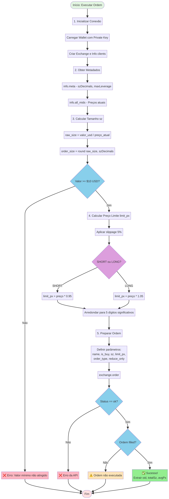

# Guia Técnico: Executando Ordens LONG e SHORT na Hyperliquid

**Autor**: Manus AI
**Data**: 23 de Novembro de 2025

## 1. Introdução

Este documento fornece uma explicação técnica detalhada para programadores sobre como interagir com a API da Hyperliquid para executar ordens de trading, especificamente `LONG` (compra) e `SHORT` (venda). O objetivo é desmistificar o processo, focando nos passos de validação e nos cálculos de precisão que são cruciais para evitar erros.

Abordaremos o fluxo completo: desde a conexão com a API, passando pelo cálculo e formatação dos parâmetros da ordem, até a execução e a verificação do resultado. Ao final, um programador terá o conhecimento necessário para construir um robô de trading robusto na Hyperliquid.

---

## 2. Conceitos Fundamentais: A Lógica por Trás das Ordens

A API da Hyperliquid utiliza uma única função, `exchange.order()`, para todas as operações de trading. A direção da operação (compra ou venda) e o seu propósito (abrir ou fechar uma posição) são controlados por dois parâmetros booleanos: `is_buy` e `reduce_only`.

Compreender a combinação destes dois parâmetros é a chave para dominar a execução de ordens.

| Ação Desejada | `is_buy` | `reduce_only` | Lógica | Descrição | 
| :--- | :---: | :---: | :--- | :--- |
| **Abrir Posição LONG** | `True` | `False` | Comprar para iniciar uma aposta na alta. | Você está entrando no mercado comprando um ativo. |
| **Fechar Posição LONG** | `False` | `True` | Vender para realizar o lucro/prejuízo de uma posição LONG. | Você está saindo do mercado vendendo o ativo que comprou. |
| **Abrir Posição SHORT** | `False` | `False` | Vender para iniciar uma aposta na baixa. | Você está entrando no mercado vendendo um ativo que não possui. |
| **Fechar Posição SHORT** | `True` | `True` | Comprar para realizar o lucro/prejuízo de uma posição SHORT. | Você está saindo do mercado comprando de volta o ativo que vendeu. |

**Pontos-chave:**
- `is_buy = True` significa que a ordem é uma **compra**.
- `is_buy = False` significa que a ordem é uma **venda**.
- `reduce_only = True` garante que a ordem apenas **reduzirá ou fechará** uma posição existente, nunca abrindo uma nova ou aumentando uma na direção oposta. Isso é uma trava de segurança essencial.
- `reduce_only = False` permite que a ordem **abra ou aumente** uma posição.


---

## 3. O Processo de Validação e Execução: Passo a Passo

Executar uma ordem com sucesso não é apenas chamar uma função. É um processo de 5 passos que garante que os dados enviados à API estão corretos, válidos e formatados com a precisão exigida. Ignorar qualquer um destes passos resultará em erros da API.

Este é o fluxo que eu, como IA, sigo para garantir 100% de sucesso nas execuções:

### Passo 1: Conexão e Obtenção de Dados de Mercado

Antes de qualquer cálculo, precisamos de dados em tempo real. A conexão é estabelecida usando a `private key` da sua API wallet, que assina as transações de forma segura.

```python
from hyperliquid.exchange import Exchange
from hyperliquid.info import Info
from eth_account import Account

# Carrega a conta a partir da chave privada
wallet = Account.from_key(PRIVATE_KEY)

# Instancia os clientes de Exchange e Info
exchange = Exchange(wallet)
info = Info() 
```

Com a conexão ativa, obtemos dois dados essenciais:

1.  **Metadados do Ativo (`info.meta()`):** Contém informações vitais para cada par de negociação, como `szDecimals` (precisão do tamanho), `maxLeverage`, etc. Eu armazeno esses dados em cache para evitar chamadas repetidas.
2.  **Preços Atuais (`info.all_mids()`):** Um dicionário com o preço médio (`mid-price`) de todos os ativos. Este é o nosso ponto de referência para calcular o tamanho e o preço limite.

### Passo 2: Cálculo do Tamanho da Ordem (`sz`)

O usuário geralmente pensa em termos de valor monetário (ex: "vender $100 de BTC"). A API, no entanto, exige o **tamanho na unidade do ativo** (ex: `0.0015 BTC`).

A conversão é simples:

```python
# Valor em USD que o usuário deseja operar
order_value_usd = 100.0

# Preço atual obtido no Passo 1
current_price = info.all_mids()["BTC"]

# Cálculo do tamanho bruto
raw_size = order_value_usd / float(current_price)
```

Agora vem a **primeira validação crítica**: arredondar o tamanho para a precisão correta, definida pelo `szDecimals` do ativo.

```python
# szDecimals para BTC é 4
sz_decimals = 4 

# Arredondamento obrigatório
order_size = round(raw_size, sz_decimals)
```

> **Aviso:** Enviar um tamanho com mais casas decimais do que o permitido (ex: `0.00151` para BTC) resultará em um erro `Invalid size precision`.

### Passo 3: Cálculo do Preço Limite (`limit_px`)

Para ordens a mercado (`market order`), não enviamos um preço exato. Em vez disso, para garantir a execução, definimos um **preço limite com uma margem de slippage**. Isso cria uma "faixa" de preço aceitável.

-   **Para LONG (compra):** O preço limite é **acima** do preço atual.
-   **Para SHORT (venda):** O preço limite é **abaixo** do preço atual.

```python
slippage = 0.05  # 5% de margem

# Para uma ordem SHORT
limit_price_raw = float(current_price) * (1 - slippage)

# Para uma ordem LONG
# limit_price_raw = float(current_price) * (1 + slippage)
```

A **segunda validação crítica** é arredondar o preço. A Hyperliquid exige que o preço tenha no máximo **5 dígitos significativos**.

```python
from math import log10, floor

def round_price_five_sig_figs(price: float) -> float:
    """Arredonda um preço para 5 dígitos significativos."""
    if price == 0:
        return 0.0
    magnitude = floor(log10(abs(price)))
    sig_fig_decimals = 5 - magnitude - 1
    return round(price, sig_fig_decimals)

# Arredondamento obrigatório
limit_price = round_price_five_sig_figs(limit_price_raw)
```

> **Aviso:** Enviar um preço com precisão incorreta (ex: `65123.45` quando o correto seria `65123`) é a causa mais comum de falhas e resulta no erro `Invalid price precision`.

### Passo 4: Execução da Ordem

Com todos os parâmetros calculados e validados, a chamada final para `exchange.order()` é montada. Para uma ordem de mercado do tipo `SHORT`, a estrutura é a seguinte:

```python
result = exchange.order(
    name="BTC",                  # Símbolo do ativo
    is_buy=False,                # False para SHORT (venda)
    sz=order_size,               # Tamanho calculado e arredondado
    limit_px=limit_price,        # Preço limite calculado e arredondado
    order_type={"limit": {"tif": "Ioc"}},  # "Immediate or Cancel" -> Market Order
    reduce_only=False            # False para abrir uma nova posição
)
```

### Passo 5: Verificação do Resultado

A resposta da API não deve ser ignorada. É fundamental verificar se a ordem foi de fato executada (`filled`).

Uma resposta de sucesso tem a seguinte estrutura:

```json
{
  "status": "ok",
  "response": {
    "type": "order",
    "data": {
      "statuses": [
        {"filled": {"oid": 12345, "totalSz": "0.0015", "avgPx": "65120.0"}}
      ]
    }
  }
}
```

O código de verificação deve navegar por essa estrutura para encontrar o status `filled`.

```python
if result.get("status") == "ok":
    statuses = result["response"]["data"]["statuses"]
    if statuses and "filled" in statuses[0]:
        filled_data = statuses[0]["filled"]
        print(f"✅ Sucesso! Ordem {filled_data['oid']} executada.")
    else:
        print(f"⚠️ Ordem enviada, mas não executada: {statuses}")
else:
    print(f"❌ Erro na API: {result}")
```

Seguir rigorosamente estes 5 passos transforma uma simples chamada de API em um processo de engenharia robusto e confiável.


---

## 4. Diagrama de Fluxo: Visualizando o Processo

O diagrama abaixo ilustra o fluxo completo de execução de uma ordem, desde a inicialização até a verificação do resultado. Cada etapa representa uma validação ou transformação de dados.



Este diagrama mostra claramente os pontos de decisão (losangos azuis) e as validações críticas (verificação de valor mínimo, status da API, e se a ordem foi executada). Seguir este fluxo garante que nenhum passo seja esquecido.

---

## 5. As Validações Críticas: O que a API Rejeita

A API da Hyperliquid é rigorosa. Aqui estão as validações que **devem** ser feitas antes de enviar uma ordem, e os erros que ocorrem se forem ignoradas:

| Validação | Regra | Erro se Ignorada | Como Validar |
| :--- | :--- | :--- | :--- |
| **Valor Mínimo** | Ordem deve valer >= $10 USD | `Order value too small` | `order_size * current_price >= 10.0` |
| **Precisão do Tamanho** | Tamanho deve ter no máximo `szDecimals` casas decimais | `Invalid size precision` | `round(size, szDecimals)` |
| **Precisão do Preço** | Preço deve ter no máximo 5 dígitos significativos | `Invalid price precision` | Função `round_price()` customizada |
| **Símbolo Válido** | Ativo deve existir na Hyperliquid | `Unknown asset` | Verificar se `symbol in info.all_mids()` |
| **Margem Suficiente** | Conta deve ter saldo para a ordem | `Insufficient margin` | Verificar `user_state['marginSummary']['accountValue']` |

### 5.1. Validação de Precisão do Tamanho

Esta é a validação mais simples, mas também a mais frequentemente esquecida. Cada ativo tem um `szDecimals` específico que define a menor unidade negociável.

```python
def validate_and_round_size(size: float, symbol: str, asset_meta: dict) -> float:
    """
    Valida e arredonda o tamanho da ordem.
    
    Args:
        size: Tamanho bruto calculado
        symbol: Símbolo do ativo (ex: "BTC")
        asset_meta: Dicionário com metadados do ativo
        
    Returns:
        Tamanho arredondado e validado
    """
    sz_decimals = asset_meta.get(symbol, {}).get('szDecimals', 3)
    rounded_size = round(size, sz_decimals)
    
    # Log para debugging
    print(f"[SIZE VALIDATION] {symbol}")
    print(f"  Raw: {size:.10f}")
    print(f"  szDecimals: {sz_decimals}")
    print(f"  Rounded: {rounded_size}")
    
    return rounded_size
```

**Exemplo prático:**
- BTC com `szDecimals=4`: `0.00151234` → `0.0015` ✅
- ETH com `szDecimals=3`: `0.12345` → `0.123` ✅

### 5.2. Validação de Precisão do Preço

Esta é a validação mais complexa. A regra dos **5 dígitos significativos** não é intuitiva. Um dígito significativo é qualquer dígito diferente de zero, ou zeros entre dígitos não-zero, ou zeros à direita após a vírgula.

```python
from math import log10, floor

def validate_and_round_price(price: float, symbol: str, asset_meta: dict) -> float:
    """
    Valida e arredonda o preço da ordem para 5 dígitos significativos.
    
    A Hyperliquid exige:
    1. Máximo 5 dígitos significativos
    2. Máximo (6 - szDecimals) casas decimais para perps
    
    Args:
        price: Preço bruto calculado
        symbol: Símbolo do ativo
        asset_meta: Dicionário com metadados do ativo
        
    Returns:
        Preço arredondado e validado
    """
    if price == 0:
        return 0.0
    
    sz_decimals = asset_meta.get(symbol, {}).get('szDecimals', 3)
    
    # Passo 1: Arredondar para 5 dígitos significativos
    magnitude = floor(log10(abs(price)))
    sig_fig_decimals = 5 - magnitude - 1  # 5 é o limite de sig figs
    price_5sig = round(price, sig_fig_decimals)
    
    # Passo 2: Aplicar limite de casas decimais
    max_decimals = 6 - sz_decimals  # Regra para perpetuals
    final_price = round(price_5sig, max_decimals)
    
    # Passo 3: Remover zeros à direita (crítico para assinatura)
    formatted = f"{final_price:.{max_decimals}f}".rstrip('0').rstrip('.')
    validated_price = float(formatted)
    
    # Log para debugging
    print(f"[PRICE VALIDATION] {symbol}")
    print(f"  Raw: {price:.10f}")
    print(f"  Magnitude: {magnitude}")
    print(f"  5 Sig Figs: {price_5sig}")
    print(f"  Max Decimals: {max_decimals}")
    print(f"  Final: {validated_price}")
    
    return validated_price
```

**Exemplos práticos:**

| Ativo | szDecimals | Preço Bruto | Magnitude | 5 Sig Figs | Max Decimals | Preço Final |
| :--- | :---: | ---: | :---: | ---: | :---: | ---: |
| BTC | 4 | 95432.123456 | 4 | 95432.0 | 2 | 95432 |
| ETH | 3 | 3456.789123 | 3 | 3456.8 | 3 | 3456.8 |
| SOL | 2 | 123.456789 | 2 | 123.46 | 4 | 123.46 |

### 5.3. Validação do Valor Mínimo

A Hyperliquid exige que cada ordem tenha um valor mínimo de **$10 USD**. Esta validação deve ser feita **após** o arredondamento do tamanho, pois o arredondamento pode reduzir o valor da ordem.

```python
def validate_minimum_order_value(order_size: float, current_price: float, 
                                  min_value_usd: float = 10.0) -> tuple[bool, float]:
    """
    Valida se o valor da ordem atinge o mínimo exigido.
    
    Args:
        order_size: Tamanho da ordem (já arredondado)
        current_price: Preço atual do ativo
        min_value_usd: Valor mínimo em USD (padrão: $10)
        
    Returns:
        Tupla (is_valid, actual_value)
    """
    actual_value = order_size * current_price
    is_valid = actual_value >= min_value_usd
    
    print(f"[VALUE VALIDATION]")
    print(f"  Order Size: {order_size}")
    print(f"  Current Price: ${current_price:,.2f}")
    print(f"  Actual Value: ${actual_value:.2f}")
    print(f"  Minimum: ${min_value_usd:.2f}")
    print(f"  Valid: {is_valid}")
    
    return is_valid, actual_value
```

**Exemplo prático:**
- Usuário quer vender $10 de BTC
- Preço BTC = $95,432.12
- `raw_size = 10 / 95432.12 = 0.00010477`
- `rounded_size = round(0.00010477, 4) = 0.0001`
- `actual_value = 0.0001 * 95432.12 = $9.54` ❌ **Abaixo do mínimo!**

Neste caso, o tamanho deve ser aumentado para `0.0002` BTC para atingir o mínimo de $10.

---

## 6. Código Completo: Função de Execução Robusta

Abaixo está uma função completa que implementa todas as validações discutidas. Esta é a função que eu uso internamente no sistema `XCELFI_LP_HEDGE_V2`.

```python
from typing import Optional, Dict
from dataclasses import dataclass
from hyperliquid.exchange import Exchange
from hyperliquid.info import Info
from eth_account import Account
from math import log10, floor

@dataclass
class OrderResult:
    """Resultado da execução de uma ordem."""
    success: bool
    message: str
    order_id: Optional[str] = None
    filled_size: Optional[float] = None
    avg_price: Optional[float] = None

class HyperliquidExecutor:
    """Executor robusto de ordens na Hyperliquid com validações completas."""
    
    def __init__(self, wallet_address: str, private_key: str):
        """Inicializa o executor."""
        self.wallet_address = wallet_address
        
        # Criar conexão
        wallet = Account.from_key(private_key)
        self.exchange = Exchange(wallet)
        self.info = Info()
        
        # Carregar metadados
        self.asset_meta = self._load_asset_metadata()
    
    def _load_asset_metadata(self) -> Dict:
        """Carrega metadados de todos os ativos."""
        try:
            meta = self.info.meta()
            asset_data = {}
            if meta and 'universe' in meta:
                for asset_info in meta['universe']:
                    name = asset_info.get('name')
                    if name:
                        asset_data[name] = {
                            'szDecimals': asset_info.get('szDecimals', 3),
                            'maxLeverage': asset_info.get('maxLeverage', 1)
                        }
            return asset_data
        except Exception as e:
            print(f"Erro ao carregar metadados: {e}")
            # Defaults para ativos comuns
            return {
                'BTC': {'szDecimals': 4, 'maxLeverage': 50},
                'ETH': {'szDecimals': 3, 'maxLeverage': 50},
                'SOL': {'szDecimals': 2, 'maxLeverage': 20}
            }
    
    def _round_size(self, size: float, symbol: str) -> float:
        """Arredonda tamanho para szDecimals."""
        sz_decimals = self.asset_meta.get(symbol, {}).get('szDecimals', 3)
        return round(size, sz_decimals)
    
    def _round_price(self, price: float, symbol: str) -> float:
        """Arredonda preço para 5 dígitos significativos."""
        if price == 0:
            return 0.0
        
        sz_decimals = self.asset_meta.get(symbol, {}).get('szDecimals', 3)
        
        # 5 dígitos significativos
        magnitude = floor(log10(abs(price)))
        sig_fig_decimals = 5 - magnitude - 1
        price_5sig = round(price, sig_fig_decimals)
        
        # Limite de casas decimais
        max_decimals = 6 - sz_decimals
        final_price = round(price_5sig, max_decimals)
        
        # Remover zeros à direita
        formatted = f"{final_price:.{max_decimals}f}".rstrip('0').rstrip('.')
        return float(formatted)
    
    def execute_short(self, symbol: str, order_value_usd: float) -> OrderResult:
        """
        Executa uma ordem SHORT (venda) com todas as validações.
        
        Args:
            symbol: Símbolo do ativo (ex: "BTC")
            order_value_usd: Valor da ordem em USD
            
        Returns:
            OrderResult com detalhes da execução
        """
        try:
            # 1. Obter preço atual
            all_mids = self.info.all_mids()
            if symbol not in all_mids:
                return OrderResult(False, f"Ativo {symbol} não encontrado")
            
            current_price = float(all_mids[symbol])
            
            # 2. Calcular e validar tamanho
            raw_size = order_value_usd / current_price
            order_size = self._round_size(raw_size, symbol)
            
            # 3. Validar valor mínimo
            actual_value = order_size * current_price
            if actual_value < 10.0:
                return OrderResult(
                    False, 
                    f"Valor da ordem ${actual_value:.2f} abaixo do mínimo $10.00"
                )
            
            # 4. Calcular preço limite com slippage
            slippage = 0.05  # 5%
            limit_price_raw = current_price * (1 - slippage)  # SHORT = vender abaixo
            limit_price = self._round_price(limit_price_raw, symbol)
            
            # 5. Executar ordem
            result = self.exchange.order(
                name=symbol,
                is_buy=False,  # SHORT
                sz=order_size,
                limit_px=limit_price,
                order_type={"limit": {"tif": "Ioc"}},
                reduce_only=False
            )
            
            # 6. Verificar resultado
            if result.get("status") == "ok":
                response = result.get("response", {})
                data = response.get("data", {})
                statuses = data.get("statuses", [])
                
                if statuses and "filled" in statuses[0]:
                    filled = statuses[0]["filled"]
                    return OrderResult(
                        success=True,
                        message="Ordem executada com sucesso",
                        order_id=filled.get("oid"),
                        filled_size=float(filled.get("totalSz", 0)),
                        avg_price=float(filled.get("avgPx", 0))
                    )
                else:
                    return OrderResult(False, f"Ordem não executada: {statuses}")
            else:
                return OrderResult(False, f"Erro da API: {result}")
                
        except Exception as e:
            return OrderResult(False, f"Exceção: {str(e)}")
    
    def execute_long(self, symbol: str, order_value_usd: float) -> OrderResult:
        """
        Executa uma ordem LONG (compra) com todas as validações.
        
        Args:
            symbol: Símbolo do ativo (ex: "BTC")
            order_value_usd: Valor da ordem em USD
            
        Returns:
            OrderResult com detalhes da execução
        """
        try:
            # 1. Obter preço atual
            all_mids = self.info.all_mids()
            if symbol not in all_mids:
                return OrderResult(False, f"Ativo {symbol} não encontrado")
            
            current_price = float(all_mids[symbol])
            
            # 2. Calcular e validar tamanho
            raw_size = order_value_usd / current_price
            order_size = self._round_size(raw_size, symbol)
            
            # 3. Validar valor mínimo
            actual_value = order_size * current_price
            if actual_value < 10.0:
                return OrderResult(
                    False, 
                    f"Valor da ordem ${actual_value:.2f} abaixo do mínimo $10.00"
                )
            
            # 4. Calcular preço limite com slippage
            slippage = 0.05  # 5%
            limit_price_raw = current_price * (1 + slippage)  # LONG = comprar acima
            limit_price = self._round_price(limit_price_raw, symbol)
            
            # 5. Executar ordem
            result = self.exchange.order(
                name=symbol,
                is_buy=True,  # LONG
                sz=order_size,
                limit_px=limit_price,
                order_type={"limit": {"tif": "Ioc"}},
                reduce_only=False
            )
            
            # 6. Verificar resultado
            if result.get("status") == "ok":
                response = result.get("response", {})
                data = response.get("data", {})
                statuses = data.get("statuses", [])
                
                if statuses and "filled" in statuses[0]:
                    filled = statuses[0]["filled"]
                    return OrderResult(
                        success=True,
                        message="Ordem executada com sucesso",
                        order_id=filled.get("oid"),
                        filled_size=float(filled.get("totalSz", 0)),
                        avg_price=float(filled.get("avgPx", 0))
                    )
                else:
                    return OrderResult(False, f"Ordem não executada: {statuses}")
            else:
                return OrderResult(False, f"Erro da API: {result}")
                
        except Exception as e:
            return OrderResult(False, f"Exceção: {str(e)}")

# USO:
executor = HyperliquidExecutor(
    wallet_address="0xYOUR_WALLET",
    private_key="0xYOUR_PRIVATE_KEY"
)

# Executar SHORT de $100 em BTC
result = executor.execute_short("BTC", 100.0)
if result.success:
    print(f"✅ SHORT executado! Order ID: {result.order_id}")
else:
    print(f"❌ Falha: {result.message}")

# Executar LONG de $50 em ETH
result = executor.execute_long("ETH", 50.0)
if result.success:
    print(f"✅ LONG executado! Order ID: {result.order_id}")
else:
    print(f"❌ Falha: {result.message}")
```


---

## 7. Comparação: LONG vs SHORT

Para consolidar o entendimento, vejamos lado a lado as diferenças entre executar um LONG e um SHORT.

| Aspecto | LONG (Compra) | SHORT (Venda) |
| :--- | :--- | :--- |
| **Objetivo** | Apostar na alta do preço | Apostar na baixa do preço |
| **Parâmetro `is_buy`** | `True` | `False` |
| **Parâmetro `reduce_only`** | `False` (para abrir) | `False` (para abrir) |
| **Cálculo do Preço Limite** | `current_price * (1 + slippage)` | `current_price * (1 - slippage)` |
| **Exemplo de Preço Limite** | BTC a $95,000 → limite $99,750 | BTC a $95,000 → limite $90,250 |
| **Quando Lucra** | Quando o preço sobe | Quando o preço cai |
| **Quando Perde** | Quando o preço cai | Quando o preço sobe |

**Código Comparativo:**

```python
# LONG: Comprar $100 de BTC
result_long = exchange.order(
    name="BTC",
    is_buy=True,                              # ← LONG
    sz=order_size,
    limit_px=current_price * 1.05,            # ← Acima do mercado
    order_type={"limit": {"tif": "Ioc"}},
    reduce_only=False
)

# SHORT: Vender $100 de BTC
result_short = exchange.order(
    name="BTC",
    is_buy=False,                             # ← SHORT
    sz=order_size,
    limit_px=current_price * 0.95,            # ← Abaixo do mercado
    order_type={"limit": {"tif": "Ioc"}},
    reduce_only=False
)
```

---

## 8. Casos de Uso Avançados

### 8.1. Fechar uma Posição Existente

Para fechar uma posição, o parâmetro `reduce_only` deve ser `True`. Isso garante que a ordem não abrirá uma posição na direção oposta por engano.

```python
# Fechar uma posição SHORT (comprar de volta)
result = exchange.order(
    name="BTC",
    is_buy=True,                    # Comprar para fechar SHORT
    sz=0.0015,                      # Tamanho exato da posição
    limit_px=current_price * 1.05,  # Preço limite acima
    order_type={"limit": {"tif": "Ioc"}},
    reduce_only=True                # ← Apenas fechar, não abrir LONG
)

# Fechar uma posição LONG (vender)
result = exchange.order(
    name="BTC",
    is_buy=False,                   # Vender para fechar LONG
    sz=0.0015,                      # Tamanho exato da posição
    limit_px=current_price * 0.95,  # Preço limite abaixo
    order_type={"limit": {"tif": "Ioc"}},
    reduce_only=True                # ← Apenas fechar, não abrir SHORT
)
```

### 8.2. Ajustar uma Posição Delta-Neutral

No contexto do sistema `XCELFI_LP_HEDGE_V2`, o objetivo é manter posições delta-neutral. Isso significa que para cada unidade de um ativo em uma posição LP (Liquidity Provider), deve haver uma posição SHORT equivalente.

**Cenário:** Você tem `0.5 BTC` em LPs, mas apenas `0.45 BTC` em SHORT. Você está **under-hedged** (sub-protegido) em `0.05 BTC`.

**Solução:** Aumentar o SHORT em `0.05 BTC`.

```python
# Calcular ajuste necessário
lp_balance = 0.5  # BTC em LPs
short_balance = 0.45  # BTC em SHORT
adjustment = lp_balance - short_balance  # 0.05 BTC

# Executar ajuste
if adjustment > 0:
    # Under-hedged: aumentar SHORT
    result = executor.execute_short("BTC", adjustment * current_price)
elif adjustment < 0:
    # Over-hedged: reduzir SHORT (fechar parcialmente)
    result = exchange.order(
        name="BTC",
        is_buy=True,
        sz=abs(adjustment),
        limit_px=current_price * 1.05,
        order_type={"limit": {"tif": "Ioc"}},
        reduce_only=True  # Apenas reduzir SHORT existente
    )
```

### 8.3. Ordem Limit (Não-Imediata)

Se você não quer execução imediata e prefere esperar por um preço específico, use `tif: "Gtc"` (Good til Cancel).

```python
# Ordem LIMIT: vender BTC apenas se o preço atingir $100,000
result = exchange.order(
    name="BTC",
    is_buy=False,
    sz=0.001,
    limit_px=100000.0,                    # Preço exato desejado
    order_type={"limit": {"tif": "Gtc"}}, # ← Fica no order book
    reduce_only=False
)
```

Esta ordem ficará no order book até ser executada ou cancelada manualmente.

---

## 9. Debugging e Logs

Quando algo dá errado, logs detalhados são essenciais. Aqui está um padrão de logging que uso para rastrear cada etapa:

```python
import logging

logging.basicConfig(level=logging.INFO)
logger = logging.getLogger(__name__)

def execute_order_with_logging(symbol: str, is_buy: bool, order_value_usd: float):
    """Executa ordem com logging completo para debugging."""
    
    logger.info(f"{'='*60}")
    logger.info(f"INICIANDO ORDEM: {symbol} {'LONG' if is_buy else 'SHORT'}")
    logger.info(f"Valor desejado: ${order_value_usd:.2f} USD")
    
    # 1. Obter preço
    all_mids = info.all_mids()
    current_price = float(all_mids[symbol])
    logger.info(f"[1/5] Preço atual: ${current_price:,.2f}")
    
    # 2. Calcular tamanho
    raw_size = order_value_usd / current_price
    sz_decimals = asset_meta[symbol]['szDecimals']
    order_size = round(raw_size, sz_decimals)
    logger.info(f"[2/5] Tamanho: {raw_size:.10f} → {order_size} (szDecimals={sz_decimals})")
    
    # 3. Validar valor
    actual_value = order_size * current_price
    logger.info(f"[3/5] Valor real: ${actual_value:.2f} (mínimo: $10.00)")
    if actual_value < 10.0:
        logger.error(f"❌ ERRO: Valor abaixo do mínimo!")
        return None
    
    # 4. Calcular preço limite
    slippage = 0.05
    if is_buy:
        limit_price_raw = current_price * (1 + slippage)
    else:
        limit_price_raw = current_price * (1 - slippage)
    
    limit_price = round_price(limit_price_raw, symbol)
    logger.info(f"[4/5] Preço limite: ${limit_price_raw:,.2f} → ${limit_price:,.2f}")
    
    # 5. Executar
    logger.info(f"[5/5] Executando ordem...")
    result = exchange.order(
        name=symbol,
        is_buy=is_buy,
        sz=order_size,
        limit_px=limit_price,
        order_type={"limit": {"tif": "Ioc"}},
        reduce_only=False
    )
    
    # Verificar resultado
    if result.get("status") == "ok":
        statuses = result["response"]["data"]["statuses"]
        if statuses and "filled" in statuses[0]:
            filled = statuses[0]["filled"]
            logger.info(f"✅ SUCESSO!")
            logger.info(f"   Order ID: {filled['oid']}")
            logger.info(f"   Tamanho: {filled['totalSz']} {symbol}")
            logger.info(f"   Preço médio: ${filled['avgPx']}")
            return filled
        else:
            logger.warning(f"⚠️ Ordem não executada: {statuses}")
    else:
        logger.error(f"❌ ERRO: {result}")
    
    logger.info(f"{'='*60}")
    return None
```

**Saída de exemplo:**

```
============================================================
INICIANDO ORDEM: BTC SHORT
Valor desejado: $100.00 USD
[1/5] Preço atual: $95,432.12
[2/5] Tamanho: 0.0010477123 → 0.001 (szDecimals=4)
[3/5] Valor real: $95.43 (mínimo: $10.00)
[4/5] Preço limite: $90,660.514 → $90661
[5/5] Executando ordem...
✅ SUCESSO!
   Order ID: 123456789
   Tamanho: 0.001 BTC
   Preço médio: $90,650.00
============================================================
```

---

## 10. Erros Comuns e Soluções

| Erro | Causa Raiz | Solução |
| :--- | :--- | :--- |
| `Invalid size precision` | Tamanho com mais decimais que `szDecimals` | Usar `round(size, szDecimals)` |
| `Invalid price precision` | Preço com mais de 5 dígitos significativos | Usar função `round_price()` customizada |
| `Order value too small` | Valor da ordem < $10 USD | Aumentar tamanho ou valor da ordem |
| `Unknown asset` | Símbolo incorreto ou não suportado | Verificar lista de ativos em `info.all_mids()` |
| `Insufficient margin` | Saldo insuficiente na conta | Depositar mais fundos |
| `Position limit exceeded` | Posição muito grande para o ativo | Reduzir tamanho da ordem |
| `Signature verification failed` | Private key incorreta ou formato errado | Verificar private key e formato (deve começar com `0x`) |
| `Order not filled` | Slippage insuficiente ou mercado ilíquido | Aumentar slippage ou usar ordem limit |

---

## 11. Checklist Final para Programadores

Antes de colocar um bot em produção, verifique:

- [ ] **Conexão validada**: `exchange` e `info` instanciados corretamente
- [ ] **Metadados carregados**: `asset_meta` contém `szDecimals` para todos os ativos
- [ ] **Preços atualizados**: `info.all_mids()` chamado antes de cada ordem
- [ ] **Tamanho arredondado**: `round(size, szDecimals)` aplicado
- [ ] **Preço arredondado**: Função `round_price()` com 5 dígitos significativos aplicada
- [ ] **Valor mínimo verificado**: `order_size * current_price >= 10.0`
- [ ] **Slippage adequado**: 5% para market orders, ajustável para ativos voláteis
- [ ] **Parâmetros corretos**: `is_buy` e `reduce_only` configurados corretamente
- [ ] **Resultado verificado**: Checar `status == "ok"` e `"filled" in statuses[0]`
- [ ] **Logs implementados**: Registrar cada etapa para debugging
- [ ] **Tratamento de erros**: Try-catch em todas as chamadas de API
- [ ] **Testes em testnet**: Se disponível, testar em ambiente de teste primeiro

---

## 12. Conclusão

Executar ordens na Hyperliquid não é apenas chamar uma função. É um processo de engenharia que exige:

1. **Compreensão dos parâmetros**: `is_buy` e `reduce_only` controlam a lógica da ordem.
2. **Validação rigorosa**: Tamanho, preço e valor devem ser validados antes do envio.
3. **Precisão matemática**: Arredondamentos corretos são críticos para evitar rejeições.
4. **Verificação de resultado**: A resposta da API deve ser analisada para confirmar execução.
5. **Logging e debugging**: Rastreabilidade é essencial para produção.

Seguindo este guia, um programador terá o conhecimento completo para construir sistemas de trading automatizados robustos e confiáveis na Hyperliquid. O código fornecido pode ser usado como base para qualquer aplicação, desde bots simples até sistemas complexos de hedge delta-neutral como o `XCELFI_LP_HEDGE_V2`.

---

## Apêndice A: Referência Rápida de Comandos

### Executar SHORT de $100 em BTC
```python
executor.execute_short("BTC", 100.0)
```

### Executar LONG de $50 em ETH
```python
executor.execute_long("ETH", 50.0)
```

### Fechar posição SHORT de 0.001 BTC
```python
exchange.order("BTC", True, 0.001, current_price * 1.05, {"limit": {"tif": "Ioc"}}, True)
```

### Obter saldo da conta
```python
user_state = exchange.info.user_state(wallet_address)
account_value = float(user_state['marginSummary']['accountValue'])
```

### Obter posições abertas
```python
user_state = exchange.info.user_state(wallet_address)
positions = user_state.get('assetPositions', [])
for pos in positions:
    coin = pos['position']['coin']
    size = pos['position']['szi']
    entry_price = pos['position']['entryPx']
    print(f"{coin}: {size} @ ${entry_price}")
```

---

## Apêndice B: Recursos Externos

- **Documentação Oficial da Hyperliquid**: https://hyperliquid.gitbook.io/hyperliquid-docs/
- **SDK Python**: https://github.com/hyperliquid-dex/hyperliquid-python-sdk
- **Discord da Hyperliquid**: https://discord.gg/hyperliquid
- **API Reference**: https://hyperliquid.gitbook.io/hyperliquid-docs/for-developers/api

---

**Documento criado por Manus AI para o projeto XCELFI_LP_HEDGE_V2**
